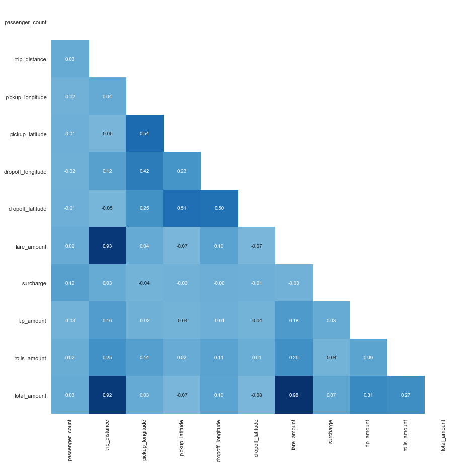
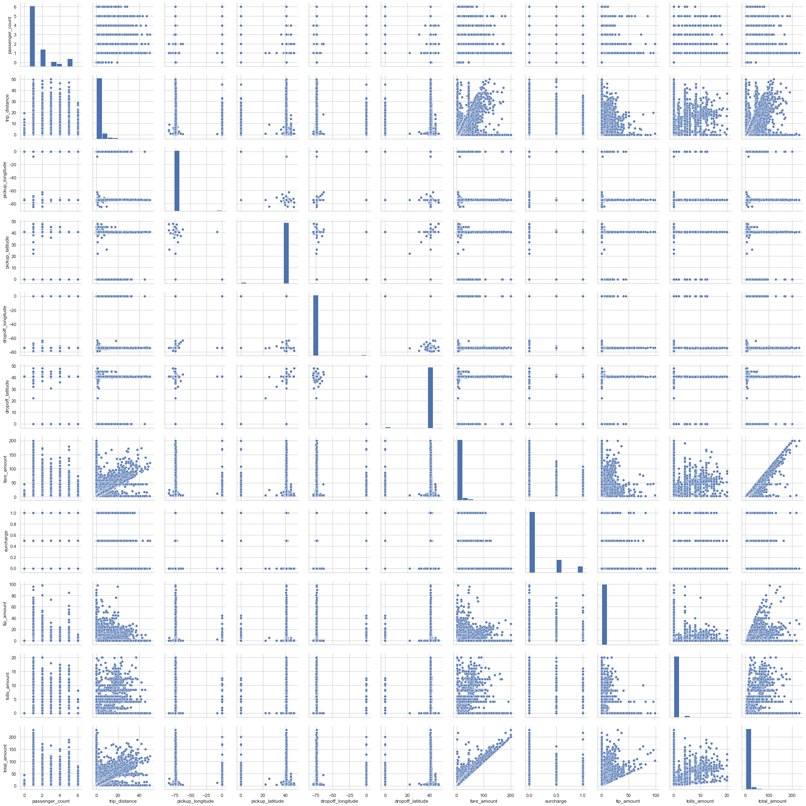
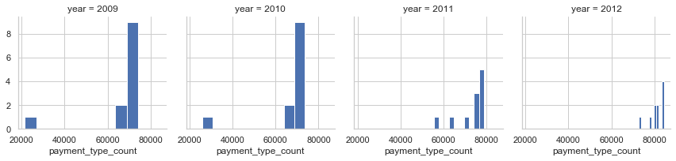

#  **Load Libraries**


```python
import matplotlib.pyplot as plt
import numpy as np
import pandas as pd
import descartes
import geopandas as gpd
from shapely.geometry import Point, Polygon
import seaborn as sns; 
sns.set(style="whitegrid")
import warnings
warnings.filterwarnings("ignore")
```

#  **Load Data**


```python
data_2009 = pd.read_json('data/data-sample_data-nyctaxi-trips-2009-json_corrigido.json', lines=True)
data_2009 = pd.DataFrame(data_2009)
```


```python
data_2010 = pd.read_json('data/data-sample_data-nyctaxi-trips-2010-json_corrigido.json', lines=True)
data_2010 = pd.DataFrame(data_2010)
```


```python
data_2011 = pd.read_json('data/data-sample_data-nyctaxi-trips-2011-json_corrigido.json', lines=True)
data_2011 = pd.DataFrame(data_2011)
```


```python
data_2012 = pd.read_json('data/data-sample_data-nyctaxi-trips-2012-json_corrigido.json', lines=True)
data_2012 = pd.DataFrame(data_2012)
```

### **Group Datasets**


```python
data = pd.concat([data_2009, data_2010, data_2011, data_2012], axis=0)
```


```python
data.shape
```


    (4000000, 17)


```python
data.to_csv('data/full_taxi_trips_data.csv', index=False)
```

## Load Main Dataset


```python
taxi_trips = pd.read_csv('data/full_taxi_trips_data.csv')
```

# **Initial Data Analysis**

## **Missing values**


```python
taxi_trips.drop(['rate_code', 'store_and_fwd_flag'], axis=1, inplace=True)
```

## **Null Values**


```python
taxi_trips.isnull().any()
```


    vendor_id            False
    pickup_datetime      False
    dropoff_datetime     False
    passenger_count      False
    trip_distance        False
    pickup_longitude     False
    pickup_latitude      False
    dropoff_longitude    False
    dropoff_latitude     False
    payment_type         False
    fare_amount          False
    surcharge            False
    tip_amount           False
    tolls_amount         False
    total_amount         False
    dtype: bool


```python
taxi_trips.info()
```

    <class 'pandas.core.frame.DataFrame'>
    RangeIndex: 4000000 entries, 0 to 3999999
    Data columns (total 15 columns):
    vendor_id            object
    pickup_datetime      object
    dropoff_datetime     object
    passenger_count      int64
    trip_distance        float64
    pickup_longitude     float64
    pickup_latitude      float64
    dropoff_longitude    float64
    dropoff_latitude     float64
    payment_type         object
    fare_amount          float64
    surcharge            float64
    tip_amount           float64
    tolls_amount         float64
    total_amount         float64
    dtypes: float64(10), int64(1), object(4)
    memory usage: 457.8+ MB


# **Exploratory Data Analysis**


```python
taxi_trips.head()
```


<div>
<style scoped>
    .dataframe tbody tr th:only-of-type {
        vertical-align: middle;
    }

    .dataframe tbody tr th {
        vertical-align: top;
    }

    .dataframe thead th {
        text-align: right;
    }
</style>
<table border="1" class="dataframe">
  <thead>
    <tr style="text-align: right;">
      <th></th>
      <th>vendor_id</th>
      <th>pickup_datetime</th>
      <th>dropoff_datetime</th>
      <th>passenger_count</th>
      <th>trip_distance</th>
      <th>pickup_longitude</th>
      <th>pickup_latitude</th>
      <th>dropoff_longitude</th>
      <th>dropoff_latitude</th>
      <th>payment_type</th>
      <th>fare_amount</th>
      <th>surcharge</th>
      <th>tip_amount</th>
      <th>tolls_amount</th>
      <th>total_amount</th>
    </tr>
  </thead>
  <tbody>
    <tr>
      <th>0</th>
      <td>CMT</td>
      <td>2009-04-21T18:51:11.767205+00:00</td>
      <td>2009-04-21T18:57:09.433767+00:00</td>
      <td>2</td>
      <td>0.80</td>
      <td>-74.004114</td>
      <td>40.742950</td>
      <td>-73.994712</td>
      <td>40.747950</td>
      <td>Cash</td>
      <td>5.4</td>
      <td>0.0</td>
      <td>0.0</td>
      <td>0.0</td>
      <td>5.4</td>
    </tr>
    <tr>
      <th>1</th>
      <td>CMT</td>
      <td>2009-01-13T07:40:07.639754+00:00</td>
      <td>2009-01-13T07:50:36.386011+00:00</td>
      <td>1</td>
      <td>5.40</td>
      <td>-73.996506</td>
      <td>40.747784</td>
      <td>-73.940449</td>
      <td>40.792385</td>
      <td>Cash</td>
      <td>15.4</td>
      <td>0.0</td>
      <td>0.0</td>
      <td>0.0</td>
      <td>15.4</td>
    </tr>
    <tr>
      <th>2</th>
      <td>VTS</td>
      <td>2009-01-06T19:30:44.142187+00:00</td>
      <td>2009-01-06T19:43:09.908429+00:00</td>
      <td>5</td>
      <td>1.67</td>
      <td>-73.951340</td>
      <td>40.752070</td>
      <td>-73.944535</td>
      <td>40.768108</td>
      <td>CASH</td>
      <td>6.1</td>
      <td>1.0</td>
      <td>0.0</td>
      <td>0.0</td>
      <td>7.1</td>
    </tr>
    <tr>
      <th>3</th>
      <td>VTS</td>
      <td>2009-09-24T08:28:09.004451+00:00</td>
      <td>2009-09-24T08:41:56.739991+00:00</td>
      <td>1</td>
      <td>4.13</td>
      <td>-74.001117</td>
      <td>40.729128</td>
      <td>-73.958122</td>
      <td>40.721812</td>
      <td>CASH</td>
      <td>12.9</td>
      <td>0.5</td>
      <td>0.0</td>
      <td>0.0</td>
      <td>13.4</td>
    </tr>
    <tr>
      <th>4</th>
      <td>VTS</td>
      <td>2009-10-29T05:50:39.214629+00:00</td>
      <td>2009-10-29T05:57:22.880174+00:00</td>
      <td>1</td>
      <td>2.03</td>
      <td>-73.976600</td>
      <td>40.756873</td>
      <td>-73.979757</td>
      <td>40.776075</td>
      <td>CASH</td>
      <td>7.7</td>
      <td>0.5</td>
      <td>0.0</td>
      <td>0.0</td>
      <td>8.2</td>
    </tr>
  </tbody>
</table>
</div>


```python
corr = taxi_trips.corr(method='spearman')
mask = np.zeros_like(corr)
mask[np.triu_indices_from(mask)] = True
fig, ax = plt.subplots()
ax.figure.set_size_inches(15, 15)
sns.heatmap(corr, ax=ax, annot=True,  mask=mask, fmt='.2f', cbar=False, square=True, cmap=plt.cm.Blues, center=0)
```


    <matplotlib.axes._subplots.AxesSubplot at 0x225f58d68>





```python
corr.style.background_gradient().set_precision(2).set_properties(**{'font-size': '8pt'})
```


<style  type="text/css" >
    #T_0be8e60a_368f_11ea_a986_0c4de9ace366row0_col0 {
            background-color:  #023858;
            color:  #f1f1f1;
            font-size:  8pt;
        }    #T_0be8e60a_368f_11ea_a986_0c4de9ace366row0_col1 {
            background-color:  #f2ecf5;
            color:  #000000;
            font-size:  8pt;
        }    #T_0be8e60a_368f_11ea_a986_0c4de9ace366row0_col2 {
            background-color:  #fdf5fa;
            color:  #000000;
            font-size:  8pt;
        }    #T_0be8e60a_368f_11ea_a986_0c4de9ace366row0_col3 {
            background-color:  #f7f0f7;
            color:  #000000;
            font-size:  8pt;
        }    #T_0be8e60a_368f_11ea_a986_0c4de9ace366row0_col4 {
            background-color:  #fff7fb;
            color:  #000000;
            font-size:  8pt;
        }    #T_0be8e60a_368f_11ea_a986_0c4de9ace366row0_col5 {
            background-color:  #f5eff6;
            color:  #000000;
            font-size:  8pt;
        }    #T_0be8e60a_368f_11ea_a986_0c4de9ace366row0_col6 {
            background-color:  #f2ecf5;
            color:  #000000;
            font-size:  8pt;
        }    #T_0be8e60a_368f_11ea_a986_0c4de9ace366row0_col7 {
            background-color:  #e5e1ef;
            color:  #000000;
            font-size:  8pt;
        }    #T_0be8e60a_368f_11ea_a986_0c4de9ace366row0_col8 {
            background-color:  #fef6fb;
            color:  #000000;
            font-size:  8pt;
        }    #T_0be8e60a_368f_11ea_a986_0c4de9ace366row0_col9 {
            background-color:  #f8f1f8;
            color:  #000000;
            font-size:  8pt;
        }    #T_0be8e60a_368f_11ea_a986_0c4de9ace366row0_col10 {
            background-color:  #f1ebf4;
            color:  #000000;
            font-size:  8pt;
        }    #T_0be8e60a_368f_11ea_a986_0c4de9ace366row1_col0 {
            background-color:  #f6eff7;
            color:  #000000;
            font-size:  8pt;
        }    #T_0be8e60a_368f_11ea_a986_0c4de9ace366row1_col1 {
            background-color:  #023858;
            color:  #f1f1f1;
            font-size:  8pt;
        }    #T_0be8e60a_368f_11ea_a986_0c4de9ace366row1_col2 {
            background-color:  #f4edf6;
            color:  #000000;
            font-size:  8pt;
        }    #T_0be8e60a_368f_11ea_a986_0c4de9ace366row1_col3 {
            background-color:  #fdf5fa;
            color:  #000000;
            font-size:  8pt;
        }    #T_0be8e60a_368f_11ea_a986_0c4de9ace366row1_col4 {
            background-color:  #eae6f1;
            color:  #000000;
            font-size:  8pt;
        }    #T_0be8e60a_368f_11ea_a986_0c4de9ace366row1_col5 {
            background-color:  #fcf4fa;
            color:  #000000;
            font-size:  8pt;
        }    #T_0be8e60a_368f_11ea_a986_0c4de9ace366row1_col6 {
            background-color:  #034973;
            color:  #f1f1f1;
            font-size:  8pt;
        }    #T_0be8e60a_368f_11ea_a986_0c4de9ace366row1_col7 {
            background-color:  #f5eff6;
            color:  #000000;
            font-size:  8pt;
        }    #T_0be8e60a_368f_11ea_a986_0c4de9ace366row1_col8 {
            background-color:  #dddbec;
            color:  #000000;
            font-size:  8pt;
        }    #T_0be8e60a_368f_11ea_a986_0c4de9ace366row1_col9 {
            background-color:  #c6cce3;
            color:  #000000;
            font-size:  8pt;
        }    #T_0be8e60a_368f_11ea_a986_0c4de9ace366row1_col10 {
            background-color:  #034d79;
            color:  #f1f1f1;
            font-size:  8pt;
        }    #T_0be8e60a_368f_11ea_a986_0c4de9ace366row2_col0 {
            background-color:  #fef6fb;
            color:  #000000;
            font-size:  8pt;
        }    #T_0be8e60a_368f_11ea_a986_0c4de9ace366row2_col1 {
            background-color:  #f1ebf5;
            color:  #000000;
            font-size:  8pt;
        }    #T_0be8e60a_368f_11ea_a986_0c4de9ace366row2_col2 {
            background-color:  #023858;
            color:  #f1f1f1;
            font-size:  8pt;
        }    #T_0be8e60a_368f_11ea_a986_0c4de9ace366row2_col3 {
            background-color:  #509ac6;
            color:  #000000;
            font-size:  8pt;
        }    #T_0be8e60a_368f_11ea_a986_0c4de9ace366row2_col4 {
            background-color:  #8fb4d6;
            color:  #000000;
            font-size:  8pt;
        }    #T_0be8e60a_368f_11ea_a986_0c4de9ace366row2_col5 {
            background-color:  #c0c9e2;
            color:  #000000;
            font-size:  8pt;
        }    #T_0be8e60a_368f_11ea_a986_0c4de9ace366row2_col6 {
            background-color:  #f0eaf4;
            color:  #000000;
            font-size:  8pt;
        }    #T_0be8e60a_368f_11ea_a986_0c4de9ace366row2_col7 {
            background-color:  #fff7fb;
            color:  #000000;
            font-size:  8pt;
        }    #T_0be8e60a_368f_11ea_a986_0c4de9ace366row2_col8 {
            background-color:  #fcf4fa;
            color:  #000000;
            font-size:  8pt;
        }    #T_0be8e60a_368f_11ea_a986_0c4de9ace366row2_col9 {
            background-color:  #e3e0ee;
            color:  #000000;
            font-size:  8pt;
        }    #T_0be8e60a_368f_11ea_a986_0c4de9ace366row2_col10 {
            background-color:  #f0eaf4;
            color:  #000000;
            font-size:  8pt;
        }    #T_0be8e60a_368f_11ea_a986_0c4de9ace366row3_col0 {
            background-color:  #fcf4fa;
            color:  #000000;
            font-size:  8pt;
        }    #T_0be8e60a_368f_11ea_a986_0c4de9ace366row3_col1 {
            background-color:  #fff7fb;
            color:  #000000;
            font-size:  8pt;
        }    #T_0be8e60a_368f_11ea_a986_0c4de9ace366row3_col2 {
            background-color:  #569dc8;
            color:  #000000;
            font-size:  8pt;
        }    #T_0be8e60a_368f_11ea_a986_0c4de9ace366row3_col3 {
            background-color:  #023858;
            color:  #f1f1f1;
            font-size:  8pt;
        }    #T_0be8e60a_368f_11ea_a986_0c4de9ace366row3_col4 {
            background-color:  #d2d3e7;
            color:  #000000;
            font-size:  8pt;
        }    #T_0be8e60a_368f_11ea_a986_0c4de9ace366row3_col5 {
            background-color:  #5c9fc9;
            color:  #000000;
            font-size:  8pt;
        }    #T_0be8e60a_368f_11ea_a986_0c4de9ace366row3_col6 {
            background-color:  #fff7fb;
            color:  #000000;
            font-size:  8pt;
        }    #T_0be8e60a_368f_11ea_a986_0c4de9ace366row3_col7 {
            background-color:  #fdf5fa;
            color:  #000000;
            font-size:  8pt;
        }    #T_0be8e60a_368f_11ea_a986_0c4de9ace366row3_col8 {
            background-color:  #fff7fb;
            color:  #000000;
            font-size:  8pt;
        }    #T_0be8e60a_368f_11ea_a986_0c4de9ace366row3_col9 {
            background-color:  #f7f0f7;
            color:  #000000;
            font-size:  8pt;
        }    #T_0be8e60a_368f_11ea_a986_0c4de9ace366row3_col10 {
            background-color:  #fff7fb;
            color:  #000000;
            font-size:  8pt;
        }    #T_0be8e60a_368f_11ea_a986_0c4de9ace366row4_col0 {
            background-color:  #fdf5fa;
            color:  #000000;
            font-size:  8pt;
        }    #T_0be8e60a_368f_11ea_a986_0c4de9ace366row4_col1 {
            background-color:  #e2dfee;
            color:  #000000;
            font-size:  8pt;
        }    #T_0be8e60a_368f_11ea_a986_0c4de9ace366row4_col2 {
            background-color:  #8bb2d4;
            color:  #000000;
            font-size:  8pt;
        }    #T_0be8e60a_368f_11ea_a986_0c4de9ace366row4_col3 {
            background-color:  #c6cce3;
            color:  #000000;
            font-size:  8pt;
        }    #T_0be8e60a_368f_11ea_a986_0c4de9ace366row4_col4 {
            background-color:  #023858;
            color:  #f1f1f1;
            font-size:  8pt;
        }    #T_0be8e60a_368f_11ea_a986_0c4de9ace366row4_col5 {
            background-color:  #63a2cb;
            color:  #000000;
            font-size:  8pt;
        }    #T_0be8e60a_368f_11ea_a986_0c4de9ace366row4_col6 {
            background-color:  #e3e0ee;
            color:  #000000;
            font-size:  8pt;
        }    #T_0be8e60a_368f_11ea_a986_0c4de9ace366row4_col7 {
            background-color:  #faf2f8;
            color:  #000000;
            font-size:  8pt;
        }    #T_0be8e60a_368f_11ea_a986_0c4de9ace366row4_col8 {
            background-color:  #fbf4f9;
            color:  #000000;
            font-size:  8pt;
        }    #T_0be8e60a_368f_11ea_a986_0c4de9ace366row4_col9 {
            background-color:  #e9e5f1;
            color:  #000000;
            font-size:  8pt;
        }    #T_0be8e60a_368f_11ea_a986_0c4de9ace366row4_col10 {
            background-color:  #e4e1ef;
            color:  #000000;
            font-size:  8pt;
        }    #T_0be8e60a_368f_11ea_a986_0c4de9ace366row5_col0 {
            background-color:  #fbf4f9;
            color:  #000000;
            font-size:  8pt;
        }    #T_0be8e60a_368f_11ea_a986_0c4de9ace366row5_col1 {
            background-color:  #fef6fb;
            color:  #000000;
            font-size:  8pt;
        }    #T_0be8e60a_368f_11ea_a986_0c4de9ace366row5_col2 {
            background-color:  #c8cde4;
            color:  #000000;
            font-size:  8pt;
        }    #T_0be8e60a_368f_11ea_a986_0c4de9ace366row5_col3 {
            background-color:  #5c9fc9;
            color:  #000000;
            font-size:  8pt;
        }    #T_0be8e60a_368f_11ea_a986_0c4de9ace366row5_col4 {
            background-color:  #71a8ce;
            color:  #000000;
            font-size:  8pt;
        }    #T_0be8e60a_368f_11ea_a986_0c4de9ace366row5_col5 {
            background-color:  #023858;
            color:  #f1f1f1;
            font-size:  8pt;
        }    #T_0be8e60a_368f_11ea_a986_0c4de9ace366row5_col6 {
            background-color:  #fff7fb;
            color:  #000000;
            font-size:  8pt;
        }    #T_0be8e60a_368f_11ea_a986_0c4de9ace366row5_col7 {
            background-color:  #fbf3f9;
            color:  #000000;
            font-size:  8pt;
        }    #T_0be8e60a_368f_11ea_a986_0c4de9ace366row5_col8 {
            background-color:  #fff7fb;
            color:  #000000;
            font-size:  8pt;
        }    #T_0be8e60a_368f_11ea_a986_0c4de9ace366row5_col9 {
            background-color:  #f9f2f8;
            color:  #000000;
            font-size:  8pt;
        }    #T_0be8e60a_368f_11ea_a986_0c4de9ace366row5_col10 {
            background-color:  #fff7fb;
            color:  #000000;
            font-size:  8pt;
        }    #T_0be8e60a_368f_11ea_a986_0c4de9ace366row6_col0 {
            background-color:  #f8f1f8;
            color:  #000000;
            font-size:  8pt;
        }    #T_0be8e60a_368f_11ea_a986_0c4de9ace366row6_col1 {
            background-color:  #034973;
            color:  #f1f1f1;
            font-size:  8pt;
        }    #T_0be8e60a_368f_11ea_a986_0c4de9ace366row6_col2 {
            background-color:  #f4edf6;
            color:  #000000;
            font-size:  8pt;
        }    #T_0be8e60a_368f_11ea_a986_0c4de9ace366row6_col3 {
            background-color:  #fef6fb;
            color:  #000000;
            font-size:  8pt;
        }    #T_0be8e60a_368f_11ea_a986_0c4de9ace366row6_col4 {
            background-color:  #ede8f3;
            color:  #000000;
            font-size:  8pt;
        }    #T_0be8e60a_368f_11ea_a986_0c4de9ace366row6_col5 {
            background-color:  #fef6fb;
            color:  #000000;
            font-size:  8pt;
        }    #T_0be8e60a_368f_11ea_a986_0c4de9ace366row6_col6 {
            background-color:  #023858;
            color:  #f1f1f1;
            font-size:  8pt;
        }    #T_0be8e60a_368f_11ea_a986_0c4de9ace366row6_col7 {
            background-color:  #fdf5fa;
            color:  #000000;
            font-size:  8pt;
        }    #T_0be8e60a_368f_11ea_a986_0c4de9ace366row6_col8 {
            background-color:  #dad9ea;
            color:  #000000;
            font-size:  8pt;
        }    #T_0be8e60a_368f_11ea_a986_0c4de9ace366row6_col9 {
            background-color:  #c2cbe2;
            color:  #000000;
            font-size:  8pt;
        }    #T_0be8e60a_368f_11ea_a986_0c4de9ace366row6_col10 {
            background-color:  #023d60;
            color:  #f1f1f1;
            font-size:  8pt;
        }    #T_0be8e60a_368f_11ea_a986_0c4de9ace366row7_col0 {
            background-color:  #e7e3f0;
            color:  #000000;
            font-size:  8pt;
        }    #T_0be8e60a_368f_11ea_a986_0c4de9ace366row7_col1 {
            background-color:  #f3edf5;
            color:  #000000;
            font-size:  8pt;
        }    #T_0be8e60a_368f_11ea_a986_0c4de9ace366row7_col2 {
            background-color:  #fff7fb;
            color:  #000000;
            font-size:  8pt;
        }    #T_0be8e60a_368f_11ea_a986_0c4de9ace366row7_col3 {
            background-color:  #f8f1f8;
            color:  #000000;
            font-size:  8pt;
        }    #T_0be8e60a_368f_11ea_a986_0c4de9ace366row7_col4 {
            background-color:  #fdf5fa;
            color:  #000000;
            font-size:  8pt;
        }    #T_0be8e60a_368f_11ea_a986_0c4de9ace366row7_col5 {
            background-color:  #f5eff6;
            color:  #000000;
            font-size:  8pt;
        }    #T_0be8e60a_368f_11ea_a986_0c4de9ace366row7_col6 {
            background-color:  #f9f2f8;
            color:  #000000;
            font-size:  8pt;
        }    #T_0be8e60a_368f_11ea_a986_0c4de9ace366row7_col7 {
            background-color:  #023858;
            color:  #f1f1f1;
            font-size:  8pt;
        }    #T_0be8e60a_368f_11ea_a986_0c4de9ace366row7_col8 {
            background-color:  #f5eff6;
            color:  #000000;
            font-size:  8pt;
        }    #T_0be8e60a_368f_11ea_a986_0c4de9ace366row7_col9 {
            background-color:  #fff7fb;
            color:  #000000;
            font-size:  8pt;
        }    #T_0be8e60a_368f_11ea_a986_0c4de9ace366row7_col10 {
            background-color:  #e9e5f1;
            color:  #000000;
            font-size:  8pt;
        }    #T_0be8e60a_368f_11ea_a986_0c4de9ace366row8_col0 {
            background-color:  #fff7fb;
            color:  #000000;
            font-size:  8pt;
        }    #T_0be8e60a_368f_11ea_a986_0c4de9ace366row8_col1 {
            background-color:  #d9d8ea;
            color:  #000000;
            font-size:  8pt;
        }    #T_0be8e60a_368f_11ea_a986_0c4de9ace366row8_col2 {
            background-color:  #fcf4fa;
            color:  #000000;
            font-size:  8pt;
        }    #T_0be8e60a_368f_11ea_a986_0c4de9ace366row8_col3 {
            background-color:  #faf3f9;
            color:  #000000;
            font-size:  8pt;
        }    #T_0be8e60a_368f_11ea_a986_0c4de9ace366row8_col4 {
            background-color:  #fef6fb;
            color:  #000000;
            font-size:  8pt;
        }    #T_0be8e60a_368f_11ea_a986_0c4de9ace366row8_col5 {
            background-color:  #faf3f9;
            color:  #000000;
            font-size:  8pt;
        }    #T_0be8e60a_368f_11ea_a986_0c4de9ace366row8_col6 {
            background-color:  #d4d4e8;
            color:  #000000;
            font-size:  8pt;
        }    #T_0be8e60a_368f_11ea_a986_0c4de9ace366row8_col7 {
            background-color:  #f5eef6;
            color:  #000000;
            font-size:  8pt;
        }    #T_0be8e60a_368f_11ea_a986_0c4de9ace366row8_col8 {
            background-color:  #023858;
            color:  #f1f1f1;
            font-size:  8pt;
        }    #T_0be8e60a_368f_11ea_a986_0c4de9ace366row8_col9 {
            background-color:  #ede7f2;
            color:  #000000;
            font-size:  8pt;
        }    #T_0be8e60a_368f_11ea_a986_0c4de9ace366row8_col10 {
            background-color:  #abbfdc;
            color:  #000000;
            font-size:  8pt;
        }    #T_0be8e60a_368f_11ea_a986_0c4de9ace366row9_col0 {
            background-color:  #f8f1f8;
            color:  #000000;
            font-size:  8pt;
        }    #T_0be8e60a_368f_11ea_a986_0c4de9ace366row9_col1 {
            background-color:  #c1cae2;
            color:  #000000;
            font-size:  8pt;
        }    #T_0be8e60a_368f_11ea_a986_0c4de9ace366row9_col2 {
            background-color:  #e2dfee;
            color:  #000000;
            font-size:  8pt;
        }    #T_0be8e60a_368f_11ea_a986_0c4de9ace366row9_col3 {
            background-color:  #f2ecf5;
            color:  #000000;
            font-size:  8pt;
        }    #T_0be8e60a_368f_11ea_a986_0c4de9ace366row9_col4 {
            background-color:  #ede7f2;
            color:  #000000;
            font-size:  8pt;
        }    #T_0be8e60a_368f_11ea_a986_0c4de9ace366row9_col5 {
            background-color:  #f3edf5;
            color:  #000000;
            font-size:  8pt;
        }    #T_0be8e60a_368f_11ea_a986_0c4de9ace366row9_col6 {
            background-color:  #bbc7e0;
            color:  #000000;
            font-size:  8pt;
        }    #T_0be8e60a_368f_11ea_a986_0c4de9ace366row9_col7 {
            background-color:  #fff7fb;
            color:  #000000;
            font-size:  8pt;
        }    #T_0be8e60a_368f_11ea_a986_0c4de9ace366row9_col8 {
            background-color:  #ede7f2;
            color:  #000000;
            font-size:  8pt;
        }    #T_0be8e60a_368f_11ea_a986_0c4de9ace366row9_col9 {
            background-color:  #023858;
            color:  #f1f1f1;
            font-size:  8pt;
        }    #T_0be8e60a_368f_11ea_a986_0c4de9ace366row9_col10 {
            background-color:  #b7c5df;
            color:  #000000;
            font-size:  8pt;
        }    #T_0be8e60a_368f_11ea_a986_0c4de9ace366row10_col0 {
            background-color:  #f7f0f7;
            color:  #000000;
            font-size:  8pt;
        }    #T_0be8e60a_368f_11ea_a986_0c4de9ace366row10_col1 {
            background-color:  #034d79;
            color:  #f1f1f1;
            font-size:  8pt;
        }    #T_0be8e60a_368f_11ea_a986_0c4de9ace366row10_col2 {
            background-color:  #f4eef6;
            color:  #000000;
            font-size:  8pt;
        }    #T_0be8e60a_368f_11ea_a986_0c4de9ace366row10_col3 {
            background-color:  #fff7fb;
            color:  #000000;
            font-size:  8pt;
        }    #T_0be8e60a_368f_11ea_a986_0c4de9ace366row10_col4 {
            background-color:  #eee8f3;
            color:  #000000;
            font-size:  8pt;
        }    #T_0be8e60a_368f_11ea_a986_0c4de9ace366row10_col5 {
            background-color:  #fff7fb;
            color:  #000000;
            font-size:  8pt;
        }    #T_0be8e60a_368f_11ea_a986_0c4de9ace366row10_col6 {
            background-color:  #023d60;
            color:  #f1f1f1;
            font-size:  8pt;
        }    #T_0be8e60a_368f_11ea_a986_0c4de9ace366row10_col7 {
            background-color:  #efe9f3;
            color:  #000000;
            font-size:  8pt;
        }    #T_0be8e60a_368f_11ea_a986_0c4de9ace366row10_col8 {
            background-color:  #b3c3de;
            color:  #000000;
            font-size:  8pt;
        }    #T_0be8e60a_368f_11ea_a986_0c4de9ace366row10_col9 {
            background-color:  #c0c9e2;
            color:  #000000;
            font-size:  8pt;
        }    #T_0be8e60a_368f_11ea_a986_0c4de9ace366row10_col10 {
            background-color:  #023858;
            color:  #f1f1f1;
            font-size:  8pt;
        }</style><table id="T_0be8e60a_368f_11ea_a986_0c4de9ace366" ><thead>    <tr>        <th class="blank level0" ></th>        <th class="col_heading level0 col0" >passenger_count</th>        <th class="col_heading level0 col1" >trip_distance</th>        <th class="col_heading level0 col2" >pickup_longitude</th>        <th class="col_heading level0 col3" >pickup_latitude</th>        <th class="col_heading level0 col4" >dropoff_longitude</th>        <th class="col_heading level0 col5" >dropoff_latitude</th>        <th class="col_heading level0 col6" >fare_amount</th>        <th class="col_heading level0 col7" >surcharge</th>        <th class="col_heading level0 col8" >tip_amount</th>        <th class="col_heading level0 col9" >tolls_amount</th>        <th class="col_heading level0 col10" >total_amount</th>    </tr></thead><tbody>
                <tr>
                        <th id="T_0be8e60a_368f_11ea_a986_0c4de9ace366level0_row0" class="row_heading level0 row0" >passenger_count</th>
                        <td id="T_0be8e60a_368f_11ea_a986_0c4de9ace366row0_col0" class="data row0 col0" >1</td>
                        <td id="T_0be8e60a_368f_11ea_a986_0c4de9ace366row0_col1" class="data row0 col1" >0.031</td>
                        <td id="T_0be8e60a_368f_11ea_a986_0c4de9ace366row0_col2" class="data row0 col2" >-0.024</td>
                        <td id="T_0be8e60a_368f_11ea_a986_0c4de9ace366row0_col3" class="data row0 col3" >-0.011</td>
                        <td id="T_0be8e60a_368f_11ea_a986_0c4de9ace366row0_col4" class="data row0 col4" >-0.019</td>
                        <td id="T_0be8e60a_368f_11ea_a986_0c4de9ace366row0_col5" class="data row0 col5" >-0.0066</td>
                        <td id="T_0be8e60a_368f_11ea_a986_0c4de9ace366row0_col6" class="data row0 col6" >0.02</td>
                        <td id="T_0be8e60a_368f_11ea_a986_0c4de9ace366row0_col7" class="data row0 col7" >0.12</td>
                        <td id="T_0be8e60a_368f_11ea_a986_0c4de9ace366row0_col8" class="data row0 col8" >-0.032</td>
                        <td id="T_0be8e60a_368f_11ea_a986_0c4de9ace366row0_col9" class="data row0 col9" >0.015</td>
                        <td id="T_0be8e60a_368f_11ea_a986_0c4de9ace366row0_col10" class="data row0 col10" >0.027</td>
            </tr>
            <tr>
                        <th id="T_0be8e60a_368f_11ea_a986_0c4de9ace366level0_row1" class="row_heading level0 row1" >trip_distance</th>
                        <td id="T_0be8e60a_368f_11ea_a986_0c4de9ace366row1_col0" class="data row1 col0" >0.031</td>
                        <td id="T_0be8e60a_368f_11ea_a986_0c4de9ace366row1_col1" class="data row1 col1" >1</td>
                        <td id="T_0be8e60a_368f_11ea_a986_0c4de9ace366row1_col2" class="data row1 col2" >0.038</td>
                        <td id="T_0be8e60a_368f_11ea_a986_0c4de9ace366row1_col3" class="data row1 col3" >-0.061</td>
                        <td id="T_0be8e60a_368f_11ea_a986_0c4de9ace366row1_col4" class="data row1 col4" >0.12</td>
                        <td id="T_0be8e60a_368f_11ea_a986_0c4de9ace366row1_col5" class="data row1 col5" >-0.055</td>
                        <td id="T_0be8e60a_368f_11ea_a986_0c4de9ace366row1_col6" class="data row1 col6" >0.93</td>
                        <td id="T_0be8e60a_368f_11ea_a986_0c4de9ace366row1_col7" class="data row1 col7" >0.026</td>
                        <td id="T_0be8e60a_368f_11ea_a986_0c4de9ace366row1_col8" class="data row1 col8" >0.16</td>
                        <td id="T_0be8e60a_368f_11ea_a986_0c4de9ace366row1_col9" class="data row1 col9" >0.25</td>
                        <td id="T_0be8e60a_368f_11ea_a986_0c4de9ace366row1_col10" class="data row1 col10" >0.92</td>
            </tr>
            <tr>
                        <th id="T_0be8e60a_368f_11ea_a986_0c4de9ace366level0_row2" class="row_heading level0 row2" >pickup_longitude</th>
                        <td id="T_0be8e60a_368f_11ea_a986_0c4de9ace366row2_col0" class="data row2 col0" >-0.024</td>
                        <td id="T_0be8e60a_368f_11ea_a986_0c4de9ace366row2_col1" class="data row2 col1" >0.038</td>
                        <td id="T_0be8e60a_368f_11ea_a986_0c4de9ace366row2_col2" class="data row2 col2" >1</td>
                        <td id="T_0be8e60a_368f_11ea_a986_0c4de9ace366row2_col3" class="data row2 col3" >0.54</td>
                        <td id="T_0be8e60a_368f_11ea_a986_0c4de9ace366row2_col4" class="data row2 col4" >0.42</td>
                        <td id="T_0be8e60a_368f_11ea_a986_0c4de9ace366row2_col5" class="data row2 col5" >0.25</td>
                        <td id="T_0be8e60a_368f_11ea_a986_0c4de9ace366row2_col6" class="data row2 col6" >0.039</td>
                        <td id="T_0be8e60a_368f_11ea_a986_0c4de9ace366row2_col7" class="data row2 col7" >-0.04</td>
                        <td id="T_0be8e60a_368f_11ea_a986_0c4de9ace366row2_col8" class="data row2 col8" >-0.016</td>
                        <td id="T_0be8e60a_368f_11ea_a986_0c4de9ace366row2_col9" class="data row2 col9" >0.14</td>
                        <td id="T_0be8e60a_368f_11ea_a986_0c4de9ace366row2_col10" class="data row2 col10" >0.033</td>
            </tr>
            <tr>
                        <th id="T_0be8e60a_368f_11ea_a986_0c4de9ace366level0_row3" class="row_heading level0 row3" >pickup_latitude</th>
                        <td id="T_0be8e60a_368f_11ea_a986_0c4de9ace366row3_col0" class="data row3 col0" >-0.011</td>
                        <td id="T_0be8e60a_368f_11ea_a986_0c4de9ace366row3_col1" class="data row3 col1" >-0.061</td>
                        <td id="T_0be8e60a_368f_11ea_a986_0c4de9ace366row3_col2" class="data row3 col2" >0.54</td>
                        <td id="T_0be8e60a_368f_11ea_a986_0c4de9ace366row3_col3" class="data row3 col3" >1</td>
                        <td id="T_0be8e60a_368f_11ea_a986_0c4de9ace366row3_col4" class="data row3 col4" >0.23</td>
                        <td id="T_0be8e60a_368f_11ea_a986_0c4de9ace366row3_col5" class="data row3 col5" >0.51</td>
                        <td id="T_0be8e60a_368f_11ea_a986_0c4de9ace366row3_col6" class="data row3 col6" >-0.069</td>
                        <td id="T_0be8e60a_368f_11ea_a986_0c4de9ace366row3_col7" class="data row3 col7" >-0.025</td>
                        <td id="T_0be8e60a_368f_11ea_a986_0c4de9ace366row3_col8" class="data row3 col8" >-0.038</td>
                        <td id="T_0be8e60a_368f_11ea_a986_0c4de9ace366row3_col9" class="data row3 col9" >0.021</td>
                        <td id="T_0be8e60a_368f_11ea_a986_0c4de9ace366row3_col10" class="data row3 col10" >-0.074</td>
            </tr>
            <tr>
                        <th id="T_0be8e60a_368f_11ea_a986_0c4de9ace366level0_row4" class="row_heading level0 row4" >dropoff_longitude</th>
                        <td id="T_0be8e60a_368f_11ea_a986_0c4de9ace366row4_col0" class="data row4 col0" >-0.019</td>
                        <td id="T_0be8e60a_368f_11ea_a986_0c4de9ace366row4_col1" class="data row4 col1" >0.12</td>
                        <td id="T_0be8e60a_368f_11ea_a986_0c4de9ace366row4_col2" class="data row4 col2" >0.42</td>
                        <td id="T_0be8e60a_368f_11ea_a986_0c4de9ace366row4_col3" class="data row4 col3" >0.23</td>
                        <td id="T_0be8e60a_368f_11ea_a986_0c4de9ace366row4_col4" class="data row4 col4" >1</td>
                        <td id="T_0be8e60a_368f_11ea_a986_0c4de9ace366row4_col5" class="data row4 col5" >0.5</td>
                        <td id="T_0be8e60a_368f_11ea_a986_0c4de9ace366row4_col6" class="data row4 col6" >0.1</td>
                        <td id="T_0be8e60a_368f_11ea_a986_0c4de9ace366row4_col7" class="data row4 col7" >-0.0025</td>
                        <td id="T_0be8e60a_368f_11ea_a986_0c4de9ace366row4_col8" class="data row4 col8" >-0.014</td>
                        <td id="T_0be8e60a_368f_11ea_a986_0c4de9ace366row4_col9" class="data row4 col9" >0.11</td>
                        <td id="T_0be8e60a_368f_11ea_a986_0c4de9ace366row4_col10" class="data row4 col10" >0.099</td>
            </tr>
            <tr>
                        <th id="T_0be8e60a_368f_11ea_a986_0c4de9ace366level0_row5" class="row_heading level0 row5" >dropoff_latitude</th>
                        <td id="T_0be8e60a_368f_11ea_a986_0c4de9ace366row5_col0" class="data row5 col0" >-0.0066</td>
                        <td id="T_0be8e60a_368f_11ea_a986_0c4de9ace366row5_col1" class="data row5 col1" >-0.055</td>
                        <td id="T_0be8e60a_368f_11ea_a986_0c4de9ace366row5_col2" class="data row5 col2" >0.25</td>
                        <td id="T_0be8e60a_368f_11ea_a986_0c4de9ace366row5_col3" class="data row5 col3" >0.51</td>
                        <td id="T_0be8e60a_368f_11ea_a986_0c4de9ace366row5_col4" class="data row5 col4" >0.5</td>
                        <td id="T_0be8e60a_368f_11ea_a986_0c4de9ace366row5_col5" class="data row5 col5" >1</td>
                        <td id="T_0be8e60a_368f_11ea_a986_0c4de9ace366row5_col6" class="data row5 col6" >-0.072</td>
                        <td id="T_0be8e60a_368f_11ea_a986_0c4de9ace366row5_col7" class="data row5 col7" >-0.0081</td>
                        <td id="T_0be8e60a_368f_11ea_a986_0c4de9ace366row5_col8" class="data row5 col8" >-0.04</td>
                        <td id="T_0be8e60a_368f_11ea_a986_0c4de9ace366row5_col9" class="data row5 col9" >0.0078</td>
                        <td id="T_0be8e60a_368f_11ea_a986_0c4de9ace366row5_col10" class="data row5 col10" >-0.077</td>
            </tr>
            <tr>
                        <th id="T_0be8e60a_368f_11ea_a986_0c4de9ace366level0_row6" class="row_heading level0 row6" >fare_amount</th>
                        <td id="T_0be8e60a_368f_11ea_a986_0c4de9ace366row6_col0" class="data row6 col0" >0.02</td>
                        <td id="T_0be8e60a_368f_11ea_a986_0c4de9ace366row6_col1" class="data row6 col1" >0.93</td>
                        <td id="T_0be8e60a_368f_11ea_a986_0c4de9ace366row6_col2" class="data row6 col2" >0.039</td>
                        <td id="T_0be8e60a_368f_11ea_a986_0c4de9ace366row6_col3" class="data row6 col3" >-0.069</td>
                        <td id="T_0be8e60a_368f_11ea_a986_0c4de9ace366row6_col4" class="data row6 col4" >0.1</td>
                        <td id="T_0be8e60a_368f_11ea_a986_0c4de9ace366row6_col5" class="data row6 col5" >-0.072</td>
                        <td id="T_0be8e60a_368f_11ea_a986_0c4de9ace366row6_col6" class="data row6 col6" >1</td>
                        <td id="T_0be8e60a_368f_11ea_a986_0c4de9ace366row6_col7" class="data row6 col7" >-0.028</td>
                        <td id="T_0be8e60a_368f_11ea_a986_0c4de9ace366row6_col8" class="data row6 col8" >0.18</td>
                        <td id="T_0be8e60a_368f_11ea_a986_0c4de9ace366row6_col9" class="data row6 col9" >0.26</td>
                        <td id="T_0be8e60a_368f_11ea_a986_0c4de9ace366row6_col10" class="data row6 col10" >0.98</td>
            </tr>
            <tr>
                        <th id="T_0be8e60a_368f_11ea_a986_0c4de9ace366level0_row7" class="row_heading level0 row7" >surcharge</th>
                        <td id="T_0be8e60a_368f_11ea_a986_0c4de9ace366row7_col0" class="data row7 col0" >0.12</td>
                        <td id="T_0be8e60a_368f_11ea_a986_0c4de9ace366row7_col1" class="data row7 col1" >0.026</td>
                        <td id="T_0be8e60a_368f_11ea_a986_0c4de9ace366row7_col2" class="data row7 col2" >-0.04</td>
                        <td id="T_0be8e60a_368f_11ea_a986_0c4de9ace366row7_col3" class="data row7 col3" >-0.025</td>
                        <td id="T_0be8e60a_368f_11ea_a986_0c4de9ace366row7_col4" class="data row7 col4" >-0.0025</td>
                        <td id="T_0be8e60a_368f_11ea_a986_0c4de9ace366row7_col5" class="data row7 col5" >-0.0081</td>
                        <td id="T_0be8e60a_368f_11ea_a986_0c4de9ace366row7_col6" class="data row7 col6" >-0.028</td>
                        <td id="T_0be8e60a_368f_11ea_a986_0c4de9ace366row7_col7" class="data row7 col7" >1</td>
                        <td id="T_0be8e60a_368f_11ea_a986_0c4de9ace366row7_col8" class="data row7 col8" >0.029</td>
                        <td id="T_0be8e60a_368f_11ea_a986_0c4de9ace366row7_col9" class="data row7 col9" >-0.036</td>
                        <td id="T_0be8e60a_368f_11ea_a986_0c4de9ace366row7_col10" class="data row7 col10" >0.072</td>
            </tr>
            <tr>
                        <th id="T_0be8e60a_368f_11ea_a986_0c4de9ace366level0_row8" class="row_heading level0 row8" >tip_amount</th>
                        <td id="T_0be8e60a_368f_11ea_a986_0c4de9ace366row8_col0" class="data row8 col0" >-0.032</td>
                        <td id="T_0be8e60a_368f_11ea_a986_0c4de9ace366row8_col1" class="data row8 col1" >0.16</td>
                        <td id="T_0be8e60a_368f_11ea_a986_0c4de9ace366row8_col2" class="data row8 col2" >-0.016</td>
                        <td id="T_0be8e60a_368f_11ea_a986_0c4de9ace366row8_col3" class="data row8 col3" >-0.038</td>
                        <td id="T_0be8e60a_368f_11ea_a986_0c4de9ace366row8_col4" class="data row8 col4" >-0.014</td>
                        <td id="T_0be8e60a_368f_11ea_a986_0c4de9ace366row8_col5" class="data row8 col5" >-0.04</td>
                        <td id="T_0be8e60a_368f_11ea_a986_0c4de9ace366row8_col6" class="data row8 col6" >0.18</td>
                        <td id="T_0be8e60a_368f_11ea_a986_0c4de9ace366row8_col7" class="data row8 col7" >0.029</td>
                        <td id="T_0be8e60a_368f_11ea_a986_0c4de9ace366row8_col8" class="data row8 col8" >1</td>
                        <td id="T_0be8e60a_368f_11ea_a986_0c4de9ace366row8_col9" class="data row8 col9" >0.09</td>
                        <td id="T_0be8e60a_368f_11ea_a986_0c4de9ace366row8_col10" class="data row8 col10" >0.31</td>
            </tr>
            <tr>
                        <th id="T_0be8e60a_368f_11ea_a986_0c4de9ace366level0_row9" class="row_heading level0 row9" >tolls_amount</th>
                        <td id="T_0be8e60a_368f_11ea_a986_0c4de9ace366row9_col0" class="data row9 col0" >0.015</td>
                        <td id="T_0be8e60a_368f_11ea_a986_0c4de9ace366row9_col1" class="data row9 col1" >0.25</td>
                        <td id="T_0be8e60a_368f_11ea_a986_0c4de9ace366row9_col2" class="data row9 col2" >0.14</td>
                        <td id="T_0be8e60a_368f_11ea_a986_0c4de9ace366row9_col3" class="data row9 col3" >0.021</td>
                        <td id="T_0be8e60a_368f_11ea_a986_0c4de9ace366row9_col4" class="data row9 col4" >0.11</td>
                        <td id="T_0be8e60a_368f_11ea_a986_0c4de9ace366row9_col5" class="data row9 col5" >0.0078</td>
                        <td id="T_0be8e60a_368f_11ea_a986_0c4de9ace366row9_col6" class="data row9 col6" >0.26</td>
                        <td id="T_0be8e60a_368f_11ea_a986_0c4de9ace366row9_col7" class="data row9 col7" >-0.036</td>
                        <td id="T_0be8e60a_368f_11ea_a986_0c4de9ace366row9_col8" class="data row9 col8" >0.09</td>
                        <td id="T_0be8e60a_368f_11ea_a986_0c4de9ace366row9_col9" class="data row9 col9" >1</td>
                        <td id="T_0be8e60a_368f_11ea_a986_0c4de9ace366row9_col10" class="data row9 col10" >0.27</td>
            </tr>
            <tr>
                        <th id="T_0be8e60a_368f_11ea_a986_0c4de9ace366level0_row10" class="row_heading level0 row10" >total_amount</th>
                        <td id="T_0be8e60a_368f_11ea_a986_0c4de9ace366row10_col0" class="data row10 col0" >0.027</td>
                        <td id="T_0be8e60a_368f_11ea_a986_0c4de9ace366row10_col1" class="data row10 col1" >0.92</td>
                        <td id="T_0be8e60a_368f_11ea_a986_0c4de9ace366row10_col2" class="data row10 col2" >0.033</td>
                        <td id="T_0be8e60a_368f_11ea_a986_0c4de9ace366row10_col3" class="data row10 col3" >-0.074</td>
                        <td id="T_0be8e60a_368f_11ea_a986_0c4de9ace366row10_col4" class="data row10 col4" >0.099</td>
                        <td id="T_0be8e60a_368f_11ea_a986_0c4de9ace366row10_col5" class="data row10 col5" >-0.077</td>
                        <td id="T_0be8e60a_368f_11ea_a986_0c4de9ace366row10_col6" class="data row10 col6" >0.98</td>
                        <td id="T_0be8e60a_368f_11ea_a986_0c4de9ace366row10_col7" class="data row10 col7" >0.072</td>
                        <td id="T_0be8e60a_368f_11ea_a986_0c4de9ace366row10_col8" class="data row10 col8" >0.31</td>
                        <td id="T_0be8e60a_368f_11ea_a986_0c4de9ace366row10_col9" class="data row10 col9" >0.27</td>
                        <td id="T_0be8e60a_368f_11ea_a986_0c4de9ace366row10_col10" class="data row10 col10" >1</td>
            </tr>
    </tbody></table>


```python
sns.pairplot(taxi_trips, plot_kws = {'alpha': 0.5})
```


    <seaborn.axisgrid.PairGrid at 0x2233641d0>





## **Feature Extraction**

### **Fields to Uppercase**


```python
taxi_trips['payment_type'] = taxi_trips['payment_type'].str.upper()
taxi_trips['vendor_id'] = taxi_trips['vendor_id'].str.upper() 
```

### **Extract Dates**


```python
taxi_trips['pickup_datetime'] = pd.to_datetime(taxi_trips['pickup_datetime'])
taxi_trips['dropoff_datetime'] = pd.to_datetime(taxi_trips['dropoff_datetime'])
taxi_trips['trip_duration'] = taxi_trips['dropoff_datetime'] - taxi_trips['pickup_datetime']
taxi_trips['day_name'] = taxi_trips['pickup_datetime'].dt.day_name().str.upper()
```


```python
taxi_trips['hour'] = taxi_trips['pickup_datetime'].dt.hour
```


```python
taxi_trips['day_month'] = taxi_trips['pickup_datetime'].dt.strftime('%d/%m')
```


```python
taxi_trips['day'] = taxi_trips['pickup_datetime'].dt.day
```


```python
taxi_trips['month'] = taxi_trips['pickup_datetime'].dt.month
```


```python
taxi_trips['year'] = taxi_trips['pickup_datetime'].dt.year
```


```python
taxi_trips.head()
```


<div>
<style scoped>
    .dataframe tbody tr th:only-of-type {
        vertical-align: middle;
    }

    .dataframe tbody tr th {
        vertical-align: top;
    }

    .dataframe thead th {
        text-align: right;
    }
</style>
<table border="1" class="dataframe">
  <thead>
    <tr style="text-align: right;">
      <th></th>
      <th>vendor_id</th>
      <th>pickup_datetime</th>
      <th>dropoff_datetime</th>
      <th>passenger_count</th>
      <th>trip_distance</th>
      <th>pickup_longitude</th>
      <th>pickup_latitude</th>
      <th>dropoff_longitude</th>
      <th>dropoff_latitude</th>
      <th>payment_type</th>
      <th>...</th>
      <th>tip_amount</th>
      <th>tolls_amount</th>
      <th>total_amount</th>
      <th>trip_duration</th>
      <th>day_name</th>
      <th>hour</th>
      <th>day_month</th>
      <th>day</th>
      <th>month</th>
      <th>year</th>
    </tr>
  </thead>
  <tbody>
    <tr>
      <th>0</th>
      <td>CMT</td>
      <td>2009-04-21 18:51:11.767205+00:00</td>
      <td>2009-04-21 18:57:09.433767+00:00</td>
      <td>2</td>
      <td>0.80</td>
      <td>-74.004114</td>
      <td>40.742950</td>
      <td>-73.994712</td>
      <td>40.747950</td>
      <td>CASH</td>
      <td>...</td>
      <td>0.0</td>
      <td>0.0</td>
      <td>5.4</td>
      <td>00:05:57.666562</td>
      <td>TUESDAY</td>
      <td>18</td>
      <td>21/04</td>
      <td>21</td>
      <td>4</td>
      <td>2009</td>
    </tr>
    <tr>
      <th>1</th>
      <td>CMT</td>
      <td>2009-01-13 07:40:07.639754+00:00</td>
      <td>2009-01-13 07:50:36.386011+00:00</td>
      <td>1</td>
      <td>5.40</td>
      <td>-73.996506</td>
      <td>40.747784</td>
      <td>-73.940449</td>
      <td>40.792385</td>
      <td>CASH</td>
      <td>...</td>
      <td>0.0</td>
      <td>0.0</td>
      <td>15.4</td>
      <td>00:10:28.746257</td>
      <td>TUESDAY</td>
      <td>7</td>
      <td>13/01</td>
      <td>13</td>
      <td>1</td>
      <td>2009</td>
    </tr>
    <tr>
      <th>2</th>
      <td>VTS</td>
      <td>2009-01-06 19:30:44.142187+00:00</td>
      <td>2009-01-06 19:43:09.908429+00:00</td>
      <td>5</td>
      <td>1.67</td>
      <td>-73.951340</td>
      <td>40.752070</td>
      <td>-73.944535</td>
      <td>40.768108</td>
      <td>CASH</td>
      <td>...</td>
      <td>0.0</td>
      <td>0.0</td>
      <td>7.1</td>
      <td>00:12:25.766242</td>
      <td>TUESDAY</td>
      <td>19</td>
      <td>06/01</td>
      <td>6</td>
      <td>1</td>
      <td>2009</td>
    </tr>
    <tr>
      <th>3</th>
      <td>VTS</td>
      <td>2009-09-24 08:28:09.004451+00:00</td>
      <td>2009-09-24 08:41:56.739991+00:00</td>
      <td>1</td>
      <td>4.13</td>
      <td>-74.001117</td>
      <td>40.729128</td>
      <td>-73.958122</td>
      <td>40.721812</td>
      <td>CASH</td>
      <td>...</td>
      <td>0.0</td>
      <td>0.0</td>
      <td>13.4</td>
      <td>00:13:47.735540</td>
      <td>THURSDAY</td>
      <td>8</td>
      <td>24/09</td>
      <td>24</td>
      <td>9</td>
      <td>2009</td>
    </tr>
    <tr>
      <th>4</th>
      <td>VTS</td>
      <td>2009-10-29 05:50:39.214629+00:00</td>
      <td>2009-10-29 05:57:22.880174+00:00</td>
      <td>1</td>
      <td>2.03</td>
      <td>-73.976600</td>
      <td>40.756873</td>
      <td>-73.979757</td>
      <td>40.776075</td>
      <td>CASH</td>
      <td>...</td>
      <td>0.0</td>
      <td>0.0</td>
      <td>8.2</td>
      <td>00:06:43.665545</td>
      <td>THURSDAY</td>
      <td>5</td>
      <td>29/10</td>
      <td>29</td>
      <td>10</td>
      <td>2009</td>
    </tr>
  </tbody>
</table>
<p>5 rows × 22 columns</p>
</div>


```python
taxi_trips.info()
```

    <class 'pandas.core.frame.DataFrame'>
    RangeIndex: 4000000 entries, 0 to 3999999
    Data columns (total 22 columns):
    vendor_id            object
    pickup_datetime      datetime64[ns, UTC]
    dropoff_datetime     datetime64[ns, UTC]
    passenger_count      int64
    trip_distance        float64
    pickup_longitude     float64
    pickup_latitude      float64
    dropoff_longitude    float64
    dropoff_latitude     float64
    payment_type         object
    fare_amount          float64
    surcharge            float64
    tip_amount           float64
    tolls_amount         float64
    total_amount         float64
    trip_duration        timedelta64[ns]
    day_name             object
    hour                 int64
    day_month            object
    day                  int64
    month                int64
    year                 int64
    dtypes: datetime64[ns, UTC](2), float64(10), int64(5), object(4), timedelta64[ns](1)
    memory usage: 671.4+ MB


# Data Hands On

## 1. What is the average distance traveled by trips with a maximum of 2 passengers;


```python
df_trips_max2_pass = taxi_trips[taxi_trips['passenger_count'] <= 2]
```


```python
df_trips_max2_pass.shape
```


    (3319652, 22)


```python
# df = df_trips_max2_pass.groupby('year').agg({'trip_distance': ['mean']})
df = df_trips_max2_pass.groupby('year').agg({'trip_distance': ['min','max', 'mean']})

df.columns = ['min_distance', 'max_distance', 'average_distance']
df = df.reset_index()
```


```python
df.head()
```


<div>
<style scoped>
    .dataframe tbody tr th:only-of-type {
        vertical-align: middle;
    }

    .dataframe tbody tr th {
        vertical-align: top;
    }

    .dataframe thead th {
        text-align: right;
    }
</style>
<table border="1" class="dataframe">
  <thead>
    <tr style="text-align: right;">
      <th></th>
      <th>year</th>
      <th>min_distance</th>
      <th>max_distance</th>
      <th>average_distance</th>
    </tr>
  </thead>
  <tbody>
    <tr>
      <th>0</th>
      <td>2009</td>
      <td>0.0</td>
      <td>49.7</td>
      <td>2.662527</td>
    </tr>
    <tr>
      <th>1</th>
      <td>2010</td>
      <td>0.0</td>
      <td>49.7</td>
      <td>2.662527</td>
    </tr>
    <tr>
      <th>2</th>
      <td>2011</td>
      <td>0.0</td>
      <td>49.7</td>
      <td>2.662527</td>
    </tr>
    <tr>
      <th>3</th>
      <td>2012</td>
      <td>0.0</td>
      <td>49.7</td>
      <td>2.662527</td>
    </tr>
  </tbody>
</table>
</div>


```python
fig = plt.figure(figsize=(20,10))
fig.suptitle("Average distance traveled by trips with a maximum of 2 passengers", fontsize=16)

ax1 = fig.add_subplot(121)
ax2 = fig.add_subplot(122)

sns.stripplot(x="year", y="trip_distance", data=taxi_trips, jitter=True, dodge=False, alpha=.3, ax=ax1)
plt.plot(df_trips_max2_pass.groupby('year').mean()['trip_distance'], "s", mfc="black", ms=10)

sns.stripplot(x="year", y="average_distance", data=df, ax=ax2)

ax1.set_ylabel('Total Trips')
ax2.set_ylabel('Average Distance (m)')

ax1.set_xlabel('Year')
ax2.set_xlabel('Year')
```


    Text(0.5, 0, 'Year')


## 2. Which are the 3 biggest vendors based on the total amount of money raised;


```python
df_bigst_vendors = taxi_trips.groupby('vendor_id').agg({'total_amount': ['sum']})
df_bigst_vendors.columns = ['total_amount_raised']
df_bigst_vendors['total_amount_raised'] =  df_bigst_vendors['total_amount_raised'].round(2)
df_bigst_vendors = df_bigst_vendors.reset_index()
```


```python
df_bigst_vendors = df_bigst_vendors.sort_values(by=['total_amount_raised'], ascending=False)
df_bigst_vendors.head()
```


<div>
<style scoped>
    .dataframe tbody tr th:only-of-type {
        vertical-align: middle;
    }

    .dataframe tbody tr th {
        vertical-align: top;
    }

    .dataframe thead th {
        text-align: right;
    }
</style>
<table border="1" class="dataframe">
  <thead>
    <tr style="text-align: right;">
      <th></th>
      <th>vendor_id</th>
      <th>total_amount_raised</th>
    </tr>
  </thead>
  <tbody>
    <tr>
      <th>0</th>
      <td>CMT</td>
      <td>19549084.28</td>
    </tr>
    <tr>
      <th>3</th>
      <td>VTS</td>
      <td>19043434.00</td>
    </tr>
    <tr>
      <th>1</th>
      <td>DDS</td>
      <td>2714901.72</td>
    </tr>
    <tr>
      <th>2</th>
      <td>TS</td>
      <td>45.60</td>
    </tr>
  </tbody>
</table>
</div>


```python
plt.figure(figsize=(10,7))
sns.set(style="whitegrid")
ax = sns.barplot(x="vendor_id", y="total_amount_raised", data=df_bigst_vendors)
plt.xlabel("Vendor")
plt.ylabel("Amount Raised ($)")
```


    Text(0, 0.5, 'Amount Raised ($)')


## 3. Make a histogram of the monthly distribution over 4 years of rides paid with cash;


```python
df_cash_paid = taxi_trips[taxi_trips['payment_type'] == 'CASH']
```


```python
df_cash_paid.head()
```


<div>
<style scoped>
    .dataframe tbody tr th:only-of-type {
        vertical-align: middle;
    }

    .dataframe tbody tr th {
        vertical-align: top;
    }

    .dataframe thead th {
        text-align: right;
    }
</style>
<table border="1" class="dataframe">
  <thead>
    <tr style="text-align: right;">
      <th></th>
      <th>vendor_id</th>
      <th>pickup_datetime</th>
      <th>dropoff_datetime</th>
      <th>passenger_count</th>
      <th>trip_distance</th>
      <th>pickup_longitude</th>
      <th>pickup_latitude</th>
      <th>dropoff_longitude</th>
      <th>dropoff_latitude</th>
      <th>payment_type</th>
      <th>...</th>
      <th>tip_amount</th>
      <th>tolls_amount</th>
      <th>total_amount</th>
      <th>trip_duration</th>
      <th>day_name</th>
      <th>hour</th>
      <th>day_month</th>
      <th>day</th>
      <th>month</th>
      <th>year</th>
    </tr>
  </thead>
  <tbody>
    <tr>
      <th>0</th>
      <td>CMT</td>
      <td>2009-04-21 18:51:11.767205+00:00</td>
      <td>2009-04-21 18:57:09.433767+00:00</td>
      <td>2</td>
      <td>0.80</td>
      <td>-74.004114</td>
      <td>40.742950</td>
      <td>-73.994712</td>
      <td>40.747950</td>
      <td>CASH</td>
      <td>...</td>
      <td>0.0</td>
      <td>0.0</td>
      <td>5.4</td>
      <td>00:05:57.666562</td>
      <td>TUESDAY</td>
      <td>18</td>
      <td>21/04</td>
      <td>21</td>
      <td>4</td>
      <td>2009</td>
    </tr>
    <tr>
      <th>1</th>
      <td>CMT</td>
      <td>2009-01-13 07:40:07.639754+00:00</td>
      <td>2009-01-13 07:50:36.386011+00:00</td>
      <td>1</td>
      <td>5.40</td>
      <td>-73.996506</td>
      <td>40.747784</td>
      <td>-73.940449</td>
      <td>40.792385</td>
      <td>CASH</td>
      <td>...</td>
      <td>0.0</td>
      <td>0.0</td>
      <td>15.4</td>
      <td>00:10:28.746257</td>
      <td>TUESDAY</td>
      <td>7</td>
      <td>13/01</td>
      <td>13</td>
      <td>1</td>
      <td>2009</td>
    </tr>
    <tr>
      <th>2</th>
      <td>VTS</td>
      <td>2009-01-06 19:30:44.142187+00:00</td>
      <td>2009-01-06 19:43:09.908429+00:00</td>
      <td>5</td>
      <td>1.67</td>
      <td>-73.951340</td>
      <td>40.752070</td>
      <td>-73.944535</td>
      <td>40.768108</td>
      <td>CASH</td>
      <td>...</td>
      <td>0.0</td>
      <td>0.0</td>
      <td>7.1</td>
      <td>00:12:25.766242</td>
      <td>TUESDAY</td>
      <td>19</td>
      <td>06/01</td>
      <td>6</td>
      <td>1</td>
      <td>2009</td>
    </tr>
    <tr>
      <th>3</th>
      <td>VTS</td>
      <td>2009-09-24 08:28:09.004451+00:00</td>
      <td>2009-09-24 08:41:56.739991+00:00</td>
      <td>1</td>
      <td>4.13</td>
      <td>-74.001117</td>
      <td>40.729128</td>
      <td>-73.958122</td>
      <td>40.721812</td>
      <td>CASH</td>
      <td>...</td>
      <td>0.0</td>
      <td>0.0</td>
      <td>13.4</td>
      <td>00:13:47.735540</td>
      <td>THURSDAY</td>
      <td>8</td>
      <td>24/09</td>
      <td>24</td>
      <td>9</td>
      <td>2009</td>
    </tr>
    <tr>
      <th>4</th>
      <td>VTS</td>
      <td>2009-10-29 05:50:39.214629+00:00</td>
      <td>2009-10-29 05:57:22.880174+00:00</td>
      <td>1</td>
      <td>2.03</td>
      <td>-73.976600</td>
      <td>40.756873</td>
      <td>-73.979757</td>
      <td>40.776075</td>
      <td>CASH</td>
      <td>...</td>
      <td>0.0</td>
      <td>0.0</td>
      <td>8.2</td>
      <td>00:06:43.665545</td>
      <td>THURSDAY</td>
      <td>5</td>
      <td>29/10</td>
      <td>29</td>
      <td>10</td>
      <td>2009</td>
    </tr>
  </tbody>
</table>
<p>5 rows × 22 columns</p>
</div>


```python
df_cash_paid.shape
```


    (3242852, 22)


```python
df_cash_paid_hist = df_cash_paid.groupby(['year', 'month']).agg({'payment_type': ['count']})
df_cash_paid_hist.columns = ['payment_type_count']
df_cash_paid_hist = df_cash_paid_hist.reset_index()
```


```python
df_cash_paid_hist.head()
```


<div>
<style scoped>
    .dataframe tbody tr th:only-of-type {
        vertical-align: middle;
    }

    .dataframe tbody tr th {
        vertical-align: top;
    }

    .dataframe thead th {
        text-align: right;
    }
</style>
<table border="1" class="dataframe">
  <thead>
    <tr style="text-align: right;">
      <th></th>
      <th>year</th>
      <th>month</th>
      <th>payment_type_count</th>
    </tr>
  </thead>
  <tbody>
    <tr>
      <th>0</th>
      <td>2009</td>
      <td>1</td>
      <td>66824</td>
    </tr>
    <tr>
      <th>1</th>
      <td>2009</td>
      <td>2</td>
      <td>66680</td>
    </tr>
    <tr>
      <th>2</th>
      <td>2009</td>
      <td>3</td>
      <td>73948</td>
    </tr>
    <tr>
      <th>3</th>
      <td>2009</td>
      <td>4</td>
      <td>71142</td>
    </tr>
    <tr>
      <th>4</th>
      <td>2009</td>
      <td>5</td>
      <td>74151</td>
    </tr>
  </tbody>
</table>
</div>


```python
plt.figure(figsize=(30,28))
sns.FacetGrid(df_cash_paid_hist, col="year").map(plt.hist, "payment_type_count")
```


    <seaborn.axisgrid.FacetGrid at 0x1e10006a0>


    <Figure size 2160x2016 with 0 Axes>





## 4. Make a time series chart computing the number of tips each day for the last 3 months of 2012.


```python
df_tips = taxi_trips[(taxi_trips['month'] >= 10) & (taxi_trips['year'] == 2012)]
```


```python
df_tips.head()
```


<div>
<style scoped>
    .dataframe tbody tr th:only-of-type {
        vertical-align: middle;
    }

    .dataframe tbody tr th {
        vertical-align: top;
    }

    .dataframe thead th {
        text-align: right;
    }
</style>
<table border="1" class="dataframe">
  <thead>
    <tr style="text-align: right;">
      <th></th>
      <th>vendor_id</th>
      <th>pickup_datetime</th>
      <th>dropoff_datetime</th>
      <th>passenger_count</th>
      <th>trip_distance</th>
      <th>pickup_longitude</th>
      <th>pickup_latitude</th>
      <th>dropoff_longitude</th>
      <th>dropoff_latitude</th>
      <th>payment_type</th>
      <th>...</th>
      <th>tip_amount</th>
      <th>tolls_amount</th>
      <th>total_amount</th>
      <th>trip_duration</th>
      <th>day_name</th>
      <th>hour</th>
      <th>day_month</th>
      <th>day</th>
      <th>month</th>
      <th>year</th>
    </tr>
  </thead>
  <tbody>
    <tr>
      <th>3000009</th>
      <td>VTS</td>
      <td>2012-10-17 11:28:59.571708+00:00</td>
      <td>2012-10-17 11:43:49.819286+00:00</td>
      <td>5</td>
      <td>0.75</td>
      <td>-74.001978</td>
      <td>40.740683</td>
      <td>-73.993722</td>
      <td>40.747330</td>
      <td>CASH</td>
      <td>...</td>
      <td>0.0</td>
      <td>0.0</td>
      <td>3.7</td>
      <td>00:14:50.247578</td>
      <td>WEDNESDAY</td>
      <td>11</td>
      <td>17/10</td>
      <td>17</td>
      <td>10</td>
      <td>2012</td>
    </tr>
    <tr>
      <th>3000011</th>
      <td>VTS</td>
      <td>2012-10-17 21:46:51.187166+00:00</td>
      <td>2012-10-17 21:52:24.351695+00:00</td>
      <td>1</td>
      <td>4.02</td>
      <td>-73.996177</td>
      <td>40.686802</td>
      <td>-73.990310</td>
      <td>40.731687</td>
      <td>CREDIT</td>
      <td>...</td>
      <td>2.0</td>
      <td>0.0</td>
      <td>14.2</td>
      <td>00:05:33.164529</td>
      <td>WEDNESDAY</td>
      <td>21</td>
      <td>17/10</td>
      <td>17</td>
      <td>10</td>
      <td>2012</td>
    </tr>
    <tr>
      <th>3000027</th>
      <td>VTS</td>
      <td>2012-10-19 11:28:47.324903+00:00</td>
      <td>2012-10-19 11:38:44.793403+00:00</td>
      <td>1</td>
      <td>1.77</td>
      <td>-73.953867</td>
      <td>40.781828</td>
      <td>-73.970007</td>
      <td>40.759648</td>
      <td>CREDIT</td>
      <td>...</td>
      <td>2.0</td>
      <td>0.0</td>
      <td>8.1</td>
      <td>00:09:57.468500</td>
      <td>FRIDAY</td>
      <td>11</td>
      <td>19/10</td>
      <td>19</td>
      <td>10</td>
      <td>2012</td>
    </tr>
    <tr>
      <th>3000029</th>
      <td>VTS</td>
      <td>2012-10-22 17:19:23.547796+00:00</td>
      <td>2012-10-22 17:29:50.335519+00:00</td>
      <td>1</td>
      <td>1.75</td>
      <td>-74.000610</td>
      <td>40.717268</td>
      <td>-73.996682</td>
      <td>40.734113</td>
      <td>CASH</td>
      <td>...</td>
      <td>0.0</td>
      <td>0.0</td>
      <td>8.5</td>
      <td>00:10:26.787723</td>
      <td>MONDAY</td>
      <td>17</td>
      <td>22/10</td>
      <td>22</td>
      <td>10</td>
      <td>2012</td>
    </tr>
    <tr>
      <th>3000030</th>
      <td>VTS</td>
      <td>2012-10-03 22:59:36.384652+00:00</td>
      <td>2012-10-03 23:12:04.900045+00:00</td>
      <td>2</td>
      <td>0.47</td>
      <td>-73.966812</td>
      <td>40.764003</td>
      <td>-73.961073</td>
      <td>40.766725</td>
      <td>CASH</td>
      <td>...</td>
      <td>0.0</td>
      <td>0.0</td>
      <td>4.7</td>
      <td>00:12:28.515393</td>
      <td>WEDNESDAY</td>
      <td>22</td>
      <td>03/10</td>
      <td>3</td>
      <td>10</td>
      <td>2012</td>
    </tr>
  </tbody>
</table>
<p>5 rows × 22 columns</p>
</div>


```python
df_tips.info()
```

    <class 'pandas.core.frame.DataFrame'>
    Int64Index: 89749 entries, 3000009 to 3999993
    Data columns (total 22 columns):
    vendor_id            89749 non-null object
    pickup_datetime      89749 non-null datetime64[ns, UTC]
    dropoff_datetime     89749 non-null datetime64[ns, UTC]
    passenger_count      89749 non-null int64
    trip_distance        89749 non-null float64
    pickup_longitude     89749 non-null float64
    pickup_latitude      89749 non-null float64
    dropoff_longitude    89749 non-null float64
    dropoff_latitude     89749 non-null float64
    payment_type         89749 non-null object
    fare_amount          89749 non-null float64
    surcharge            89749 non-null float64
    tip_amount           89749 non-null float64
    tolls_amount         89749 non-null float64
    total_amount         89749 non-null float64
    trip_duration        89749 non-null timedelta64[ns]
    day_name             89749 non-null object
    hour                 89749 non-null int64
    day_month            89749 non-null object
    day                  89749 non-null int64
    month                89749 non-null int64
    year                 89749 non-null int64
    dtypes: datetime64[ns, UTC](2), float64(10), int64(5), object(4), timedelta64[ns](1)
    memory usage: 15.7+ MB


```python
df_tips.head()
```


<div>
<style scoped>
    .dataframe tbody tr th:only-of-type {
        vertical-align: middle;
    }

    .dataframe tbody tr th {
        vertical-align: top;
    }

    .dataframe thead th {
        text-align: right;
    }
</style>
<table border="1" class="dataframe">
  <thead>
    <tr style="text-align: right;">
      <th></th>
      <th>vendor_id</th>
      <th>pickup_datetime</th>
      <th>dropoff_datetime</th>
      <th>passenger_count</th>
      <th>trip_distance</th>
      <th>pickup_longitude</th>
      <th>pickup_latitude</th>
      <th>dropoff_longitude</th>
      <th>dropoff_latitude</th>
      <th>payment_type</th>
      <th>...</th>
      <th>tip_amount</th>
      <th>tolls_amount</th>
      <th>total_amount</th>
      <th>trip_duration</th>
      <th>day_name</th>
      <th>hour</th>
      <th>day_month</th>
      <th>day</th>
      <th>month</th>
      <th>year</th>
    </tr>
  </thead>
  <tbody>
    <tr>
      <th>3000009</th>
      <td>VTS</td>
      <td>2012-10-17 11:28:59.571708+00:00</td>
      <td>2012-10-17 11:43:49.819286+00:00</td>
      <td>5</td>
      <td>0.75</td>
      <td>-74.001978</td>
      <td>40.740683</td>
      <td>-73.993722</td>
      <td>40.747330</td>
      <td>CASH</td>
      <td>...</td>
      <td>0.0</td>
      <td>0.0</td>
      <td>3.7</td>
      <td>00:14:50.247578</td>
      <td>WEDNESDAY</td>
      <td>11</td>
      <td>17/10</td>
      <td>17</td>
      <td>10</td>
      <td>2012</td>
    </tr>
    <tr>
      <th>3000011</th>
      <td>VTS</td>
      <td>2012-10-17 21:46:51.187166+00:00</td>
      <td>2012-10-17 21:52:24.351695+00:00</td>
      <td>1</td>
      <td>4.02</td>
      <td>-73.996177</td>
      <td>40.686802</td>
      <td>-73.990310</td>
      <td>40.731687</td>
      <td>CREDIT</td>
      <td>...</td>
      <td>2.0</td>
      <td>0.0</td>
      <td>14.2</td>
      <td>00:05:33.164529</td>
      <td>WEDNESDAY</td>
      <td>21</td>
      <td>17/10</td>
      <td>17</td>
      <td>10</td>
      <td>2012</td>
    </tr>
    <tr>
      <th>3000027</th>
      <td>VTS</td>
      <td>2012-10-19 11:28:47.324903+00:00</td>
      <td>2012-10-19 11:38:44.793403+00:00</td>
      <td>1</td>
      <td>1.77</td>
      <td>-73.953867</td>
      <td>40.781828</td>
      <td>-73.970007</td>
      <td>40.759648</td>
      <td>CREDIT</td>
      <td>...</td>
      <td>2.0</td>
      <td>0.0</td>
      <td>8.1</td>
      <td>00:09:57.468500</td>
      <td>FRIDAY</td>
      <td>11</td>
      <td>19/10</td>
      <td>19</td>
      <td>10</td>
      <td>2012</td>
    </tr>
    <tr>
      <th>3000029</th>
      <td>VTS</td>
      <td>2012-10-22 17:19:23.547796+00:00</td>
      <td>2012-10-22 17:29:50.335519+00:00</td>
      <td>1</td>
      <td>1.75</td>
      <td>-74.000610</td>
      <td>40.717268</td>
      <td>-73.996682</td>
      <td>40.734113</td>
      <td>CASH</td>
      <td>...</td>
      <td>0.0</td>
      <td>0.0</td>
      <td>8.5</td>
      <td>00:10:26.787723</td>
      <td>MONDAY</td>
      <td>17</td>
      <td>22/10</td>
      <td>22</td>
      <td>10</td>
      <td>2012</td>
    </tr>
    <tr>
      <th>3000030</th>
      <td>VTS</td>
      <td>2012-10-03 22:59:36.384652+00:00</td>
      <td>2012-10-03 23:12:04.900045+00:00</td>
      <td>2</td>
      <td>0.47</td>
      <td>-73.966812</td>
      <td>40.764003</td>
      <td>-73.961073</td>
      <td>40.766725</td>
      <td>CASH</td>
      <td>...</td>
      <td>0.0</td>
      <td>0.0</td>
      <td>4.7</td>
      <td>00:12:28.515393</td>
      <td>WEDNESDAY</td>
      <td>22</td>
      <td>03/10</td>
      <td>3</td>
      <td>10</td>
      <td>2012</td>
    </tr>
  </tbody>
</table>
<p>5 rows × 22 columns</p>
</div>


```python
df_tips_amount = df_tips.groupby(['day_month']).agg({'tip_amount': ['count']})
df_tips_amount.columns = ['tip_per_day']
df_tips_amount = df_tips_amount.reset_index()
```


```python
df_tips_amount.info()
```

    <class 'pandas.core.frame.DataFrame'>
    RangeIndex: 27 entries, 0 to 26
    Data columns (total 2 columns):
    day_month      27 non-null object
    tip_per_day    27 non-null int64
    dtypes: int64(1), object(1)
    memory usage: 560.0+ bytes


```python
df_tips_amount.shape
```


    (27, 2)


```python
plt.figure(figsize=(15,7))
sns.set(style="darkgrid")

sns.lineplot(x="day_month", y="tip_per_day", color="coral", data=df_tips_amount)
plt.title("Number of tips each day")
plt.xlabel("Day/Month")
plt.xticks(rotation=45)
plt.ylabel("Tips Number")
```


    Text(0, 0.5, 'Tips Number')


# **Bonus items**

## What is the average trip time on Saturdays and Sundays;


```python
df_weekend_rides = taxi_trips[taxi_trips['day_name'].isin(['SATURDAY', 'SUNDAY'])]
df_weekend_rides = df_weekend_rides.groupby('day_name')['trip_duration'].agg(lambda x: x.mean())
df_weekend_rides.columns = ['trip_duration']
df_weekend_rides = df_weekend_rides.reset_index()
```


```python
df_weekend_rides.head()
```


<div>
<style scoped>
    .dataframe tbody tr th:only-of-type {
        vertical-align: middle;
    }

    .dataframe tbody tr th {
        vertical-align: top;
    }

    .dataframe thead th {
        text-align: right;
    }
</style>
<table border="1" class="dataframe">
  <thead>
    <tr style="text-align: right;">
      <th></th>
      <th>day_name</th>
      <th>trip_duration</th>
    </tr>
  </thead>
  <tbody>
    <tr>
      <th>0</th>
      <td>SATURDAY</td>
      <td>00:08:44.939775</td>
    </tr>
    <tr>
      <th>1</th>
      <td>SUNDAY</td>
      <td>00:08:44.641298</td>
    </tr>
  </tbody>
</table>
</div>


```python
plt.figure(figsize=(10,7))
sns.set(style="whitegrid")
ax = sns.barplot(x="day_name", y="trip_duration", data=df_weekend_rides)
plt.xlabel("Day")
plt.ylabel("Trip Duration Average (h)")
```


    Text(0, 0.5, 'Trip Duration Average (h)')


